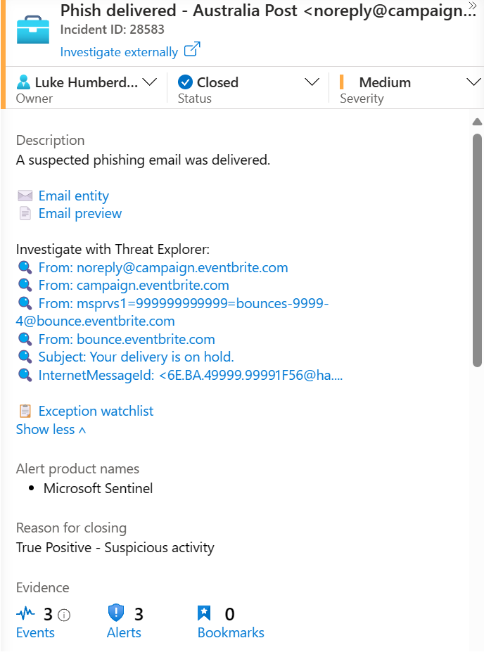

# EmailInvestigateLinks

## Overview

Outputs links you can use in alert description texts (or any other context supporting markdown), giving you one-click email investigation superpowers.

## Usage

Consider the following analytics rule. Call `EmailInvestigateLinks` with these parameters:

```kusto
EmailEvents
| where EmailDirection == "Inbound"
| where OrgLevelPolicy != "SecOps Mailbox"
| where ThreatTypes has "Phish"
| where DeliveryLocation == "Inbox/folder"
| extend
    AlertDescriptionText = strcat(
        "A suspected phishing email was delivered.<br><br>",
        EmailInvestigateLinks(NetworkMessageId, SenderFromAddress, SenderFromDomain, SenderMailFromAddress, SenderMailFromDomain, RecipientEmailAddress, Subject, InternetMessageId)
    )
```

Configure your analytics rule to reference `AlertDescriptionText` for its alert description text.

Refer to [EmailInvestigateLinks.txt](./EmailInvestigateLinks.txt) for workspace function code.

## Sample output



Clicking an investigation link will launch a new browser tab to the Defender portal.