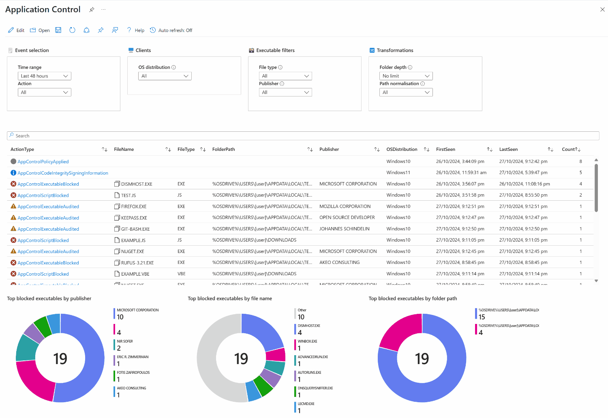

# Application Control

This Sentinel workbook provides reporting of AppLocker or WDAC (Windows Defender Application Control) events across your endpoints. Data is sourced from the `DeviceEvents` table in Defender XDR.

For more information on app control events in Defender, see *[Querying App Control events centrally using Advanced hunting](https://learn.microsoft.com/en-us/windows/security/application-security/application-control/app-control-for-business/operations/querying-application-control-events-centrally-using-advanced-hunting)*.

## Features

A range of parameters are provided to filter and transform data.

### Filters

* **Time range**
* **Action**: `ActionType`, including:
  * Executables
    * ⚠️ `AppControlExecutableAudited`
    * 🚫 `AppControlExecutableBlocked`
  * Scripts
    * ⚠️ `AppControlScriptAudited`
    * 🚫 `AppControlScriptBlocked`
  * Packaged apps
    * ⚠️ `AppControlPackagedAppAudited`
    * 🚫 `AppControlPackagedAppBlocked`
  * Policy
    * ⚫ `AppControlPolicyApplied`
    * 🔃 `AppControlCodeIntegrityPolicyLoaded`
  * Code integrity
    * ⚠️ `AppControlCIScriptAudited`
    * ⚠️ `AppControlCodeIntegrityOriginAudited`
    * ⚠️ `AppControlCodeIntegrityPolicyAudited`
    * ⛔ `AppControlCodeIntegrityDriverRevoked`
    * ⛔ `AppControlCodeIntegrityImageRevoked`
    * ✅ `AppControlCodeIntegrityOriginAllowed`
    * 🔵 `AppControlCodeIntegritySigningInformation`
    * 🚫 `AppControlCIScriptBlocked`
    * 🚫 `AppControlCodeIntegrityOriginBlocked`
    * 🚫 `AppControlCodeIntegrityPolicyBlocked`
* **OS distribution**: Client operating system.
* **File type**: File extension (e.g. .exe, .ps1, .vbs).
* **Publisher**: Publisher of executables, scripts or packaged apps.

### Transformations

* **Folder depth**: 
Trim path depth in order to improve reporting of paths in aggregate.
* **Path normalisation**: 
Subtitute common path slugs, such as usernames, GUIDs and numbers, in order to improve reporting of paths in aggregate.

### Display

* Searchable table which displays application control events in aggregrate, including first and last seen times.
  * Click an entry to see additional details such as process command line, folder path, SHA-1, SHA-256, MD5.
* Top blocked executables by publisher
* Top blocked executables by file name
* Top blocked executables by folder path
* Top action types

## Requirements

* AppLocker or WDAC configured on your endpoints.
* Defender for Endpoint installed on your endpoints.
* `DeviceEvents` configured to stream to your Sentinel workspace.

## Installation

### Deploy automatically from ARM template

### Deploy manually from workbook source

1. In your Sentinel workspace, navigate to **Workbooks** > **Add Workbook**.
2. Click **Edit**, then click the **Advanced Editor** button.
3. Copy the contents of [ApplicationControl.json](./ApplicationControl.json) and paste it into the **Gallery Template** field.
4. Click **Apply**, then **Save**.
